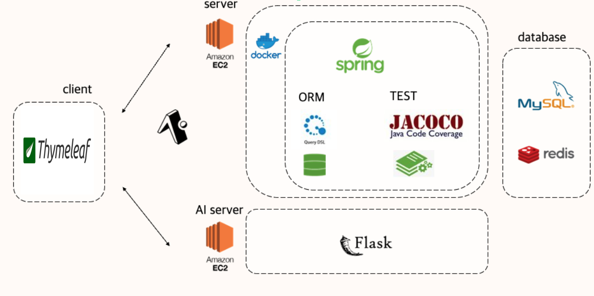

### 캡스톤 프로젝트 - CODEVIEWER

| &nbsp;&nbsp;&nbsp;&nbsp;&nbsp;&nbsp;&nbsp;&nbsp;&nbsp;&nbsp; 고세윤 &nbsp;&nbsp;&nbsp;&nbsp;&nbsp;&nbsp;&nbsp;&nbsp;&nbsp;&nbsp; |
|:---:|  
| -   - Back-end & Front-end    - [GitHub](https://github.com/gosekose/codeviwer) |

### Languages

 </a> &nbsp
 </a> &nbsp
 </a> &nbsp
 </a> &nbsp

 

### Technologies

 </a> &nbsp
 </a> &nbsp
 </a> &nbsp
 </a> &nbsp
 </a> &nbsp
 </a> &nbsp

 
 
### Api Tool

  </a> &nbsp
  </a> &nbsp

 

---

 

# 📝 목차
- [API 문서](#api)
- [아키텍처](#structure)
- [주요기능](#result)
- [배운점](#result)

 

# 📋 API 문서  

[API 문서 링크] 

 

# 🛠 아키텍처  

 
 
 

+ 프론트
    - Tymeleaf를 활용한 Server Side Rendering 
    
+ 백엔드
    - Spring 기반 서버
    - DDD 기반 설계
    - 데이터 접근 기술은 JPA와 복잡한 동적 쿼리의 경우 Querydsl 사용
    - 현재 70개의 단위, 통합 테스트
    - DB는 H2(MySQL)과 Rredis 사용
    
+ AI
    - Flask 기반 API 서버

 

 

# 💎 주요 기능 

 

    

 

 
## 온라인 과제 시험, 과제 수행 환경을 제공하는 웹 프로젝트 
+ 배경 
    - 온라인 시험 플랫폼이 다수 존재하지만, 사용자 개별 코딩 과제나 시험을 치뤄야할 때 활용 가능한 오픈소스 시험 플랫폼을 제공하고자 함
  
+ 기능
    - 유저는 다양한 그룹을 생성, 그룹 회원 가입 승인 및 강퇴, 그룹 문제 풀이 차트 정보 제공
    - Java와 Python으로 해결 가능한 알고리즘 문제나 코딩 과제 생성, 문제 테스트 환경 제공 
    - 문제 푼 후 결과 확인, 문제 풀이에 대한 다양한 차트 정보 및 질문 게시판 제공
  

## 공통
 
### 유저 가입 

 

 
유저는 로그인을 할 수 있습니다.
  
### 프로필 등록 

 
 

 
유저는 프로필을 설정할 수 있습니다.
 

## 그룹 호스트

  
### 그룹 생성 

 

 
1. 공개 설정 및 비공개 설정으로 그룹을 개설할 수 있습니다.

 
### 그룹 관리
 

 
 
 

 
1. 그룹 호스트는 그룹의 가입 신청 관리, 회원 관리, 문제 관리, 그룹 관리를 진행할 수 있습니다.
2. 그룹 호스트는 가입 신청한 회원을 승인/거부 할 수 있습니다.
3. 그룹 호스트는 가입한 회원의 리스트를 볼 수 있습니다.
 
 

### 문제 생성
 

 
 
 
 

 
1. 그룹 호스트는 문제 이름, 문제 설명, 입출력 설정으로 문제를 생성할 수 있습니다.
2. 문제의 정합성을 확인하기 위해 문제의 해답에 해당하는 소스와 입출력 파일(zip) 테스트를 제공하고, 입출력 zip 파일은 자동 압축해제하여 저장됩니다.
3. 각 언어에 맞는 api 서버 호출을 통해 서버 테스트를 진행합니다.
4. 미리보기 기능을 제공합니다.

 
 
### 응시자 정보 열람
 

 

 
1. 응시자의 문제 해결 시도, 점수 등을 차트로 확인할 수 있습니다.
 
 
## 그룹 회원
 
### 그룹 찾기 밎 가입
 

 

 
1. 유저는 그룹을 찾거나 가입 신청할 수 있습니다. 자동 가입 여부에 따라 바로 가입이 될 수 있습니다.
 
 
### 문제 풀기
 

 

 
1. 유저는 출제자의 문제 풀이 가능 언어에 따라 해당 언어로 문제를 직접 작성하거나 파일을 제출할 수 있습니다.
 
 
### 질문 등록
 

 
 
 

 
1. 유저는 문제 질문시 팝업창 제공하고 그 외의 버그 신고, 시스템 질문 등을 할 수 있습니다.
2. 질문 등록은 공개/비공개 익명 등록 등을 제공합니다.
 

# 📌 배운점 

 

