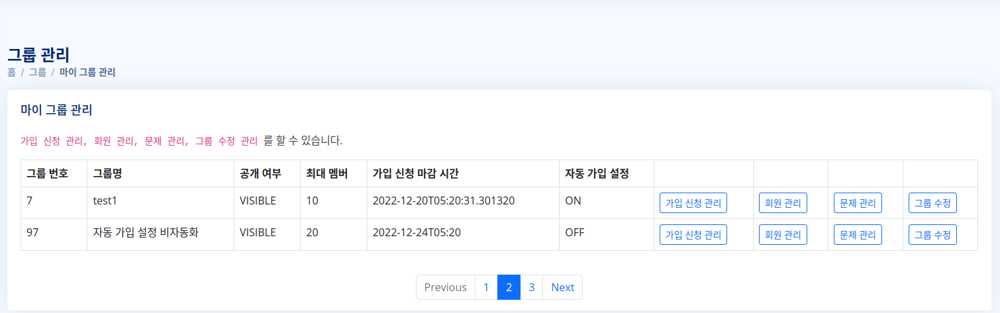
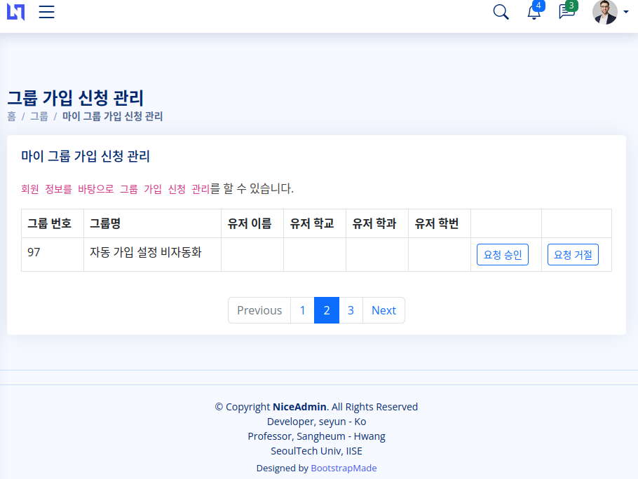
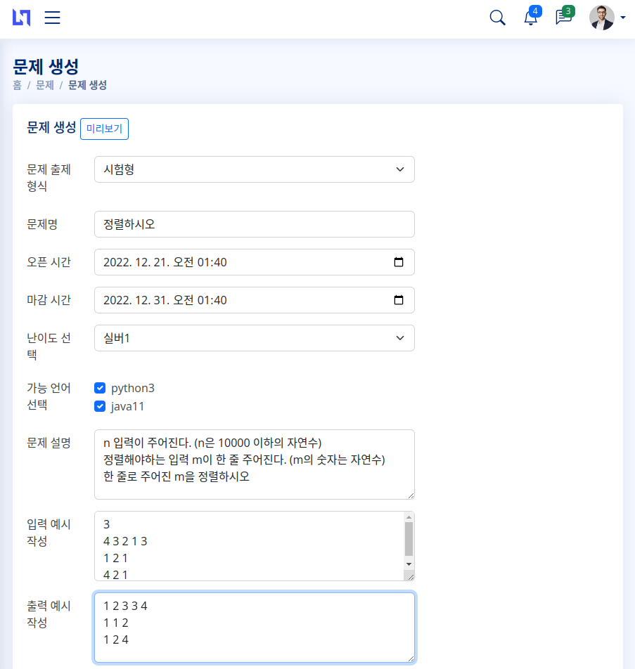

### CODEVIEWER

| &nbsp;&nbsp;&nbsp;&nbsp;&nbsp;&nbsp;&nbsp;&nbsp;&nbsp;&nbsp; 고세윤 &nbsp;&nbsp;&nbsp;&nbsp;&nbsp;&nbsp;&nbsp;&nbsp;&nbsp;&nbsp; |
|:---:|  
| -   - Back-end & Front-end    - [GitHub](https://github.com/gosekose/codeviwer) |

### Technologies

 </a>
 </a>
 </a>
 </a>
 </a>
 </a>
 </a>

 
 
### Api Tool

  </a>
  </a>

 

---

 

# 📝 목차
- [아키텍처](#structure)
- [주요기능](#result)
- [배운점](#result)

 

# 🛠 아키텍처  

 
 

+ 프론트
    - Tymeleaf를 활용한 Server Side Rendering 
    
+ 백엔드
    - Spring 기반 서버
    - DDD 기반 설계
    - 데이터 접근 기술은 JPA와 복잡한 동적 쿼리의 경우 Querydsl 사용
    - 현재 70개의 단위, 통합 테스트
    - DB는 H2(MySQL)과 Rredis 사용
    
 

 

# 💎 주요 기능 

 

## 온라인 과제 시험, 과제 수행 환경을 제공하는 웹 프로젝트

+ 배경 
    - 온라인 시험 플랫폼이 다수 존재하지만, 사용자 개별 코딩 과제나 시험을 치뤄야할 때 활용 가능한 오픈소스 시험 플랫폼을 제공하고자 함
  
+ 기능
    - 유저는 다양한 그룹을 생성, 그룹 회원 가입 승인 및 강퇴, 그룹 문제 풀이 차트 정보 제공
    - Java와 Python으로 해결 가능한 알고리즘 문제나 코딩 과제 생성, 문제 테스트 환경 제공 
    - 문제 푼 후 결과 확인, 문제 풀이에 대한 다양한 차트 정보 및 질문 게시판 제공
## 공통
### 유저 가입

 

 
유저는 로그인을 할 수 있습니다.

### 프로필 등록

 
 

 
유저는 프로필을 설정할 수 있습니다.

## 그룹 호스트

### 그룹 생성

 

 
1. 공개 설정 및 비공개 설정으로 그룹을 개설할 수 있습니다.

### 그룹 관리

 
 
 

 
1. 그룹 호스트는 그룹의 가입 신청 관리, 회원 관리, 문제 관리, 그룹 관리를 진행할 수 있습니다.  
2. 그룹 호스트는 가입 신청한 회원을 승인/거부 할 수 있습니다.  
3. 그룹 호스트는 가입한 회원의 리스트를 볼 수 있습니다.  

### 문제 생성

  
 
 
 

 
1. 그룹 호스트는 문제 이름, 문제 설명, 입출력 설정으로 문제를 생성할 수 있습니다.  
2. 문제의 정합성을 확인하기 위해 문제의 해답에 해당하는 소스와 입출력 파일(zip) 테스트를 제공하고, 입출력 zip 파일은 자동 압축해제하여 저장됩니다.  
3. 각 언어에 맞는 api 서버 호출을 통해 서버 테스트를 진행합니다.  
4. 미리보기 기능을 제공합니다.  

### 응시자 정보 열람

 

 
1. 응시자의 문제 해결 시도, 점수 등을 차트로 확인할 수 있습니다. 

## 그룹 회원
### 그룹 찾기 밎 가입

 

 
1. 유저는 그룹을 찾거나 가입 신청할 수 있습니다. 자동 가입 여부에 따라 바로 가입이 될 수 있습니다.

### 문제 풀기

 

 
1. 유저는 출제자의 문제 풀이 가능 언어에 따라 해당 언어로 문제를 직접 작성하거나 파일을 제출할 수 있습니다.

### 질문 등록

 
 
 

 
1. 유저는 문제 질문시 팝업창 제공하고 그 외의 버그 신고, 시스템 질문 등을 할 수 있습니다.  
2. 질문 등록은 공개/비공개 익명 등록 등을 제공합니다.  
 

# 📌 배운점 

1. 첫 백엔드 프로젝트이다 보니, 프로젝트 폴더와 위치 이름 등이 가시적이지 않아서 리팩토링에 어려움이 있었습니다. 메서드명으로도 이 코드가 어떤 역할을 수행하는지 알 수 있을 정도로 명시적인 코드를 작성해야 하는 점을 배울 수 있었습니다.

2. 백엔드에서 사용자의 코드를 입력받아, 동적으로 실행하는 로직을 작성하고 싶었지만, 동적 컴파일 후 클래스를 로드하는 과정에서 많은 어려움이 따랐습니다. 이를 극복하기 위해 flask로 외부 서버를 두어 자바 코드를 컴파일하고 실행하는 코드를 작성하였습니다. 하지만, 스프링부트 내에서 모든 것을 해결하지 못했다는 아쉬움이 계속 남았습니다. 이 부분은 추후 리팩토링 과정에서 해결해야 하는 과제로 두었습니다.

3. Exception 코드를 묶어서 처리해야 하는 과정을 몰랐었다 보니, 중구난방으로 Exception 발생시키는 코드가 구현되었습니다. 추후 리팩토링할 때, ExceptionAdvice를 적용하는 코드를 작성하도록 하겠습니다.

4. 코딩 테스트를 진행할 때, 문자 입출력 파일을 클라이언트에게 받습니다. 이 과정에서 문제 번호마다 임의의 문자열을 가진 폴더를 생성하여 그곳에 저장하도록 하는 로직을 작성하였습니다. 하지만, 새로고침 등을 하게 되면, 데이터베이스에 저장된 폴더명 이외의 임시 폴더들은 전부 삭제해야 했습니다. 이는 비효율적인 방법이라는 생각이 들었습니다. 추후 리펙토링을 하면, 이 문제를 어떻게 해결해야 할 지 대책을 세우고 더 효율적으로 임시 폴더와 파일을 처리하는 과정을 효율적으로 해결해보고 싶습니다.

5. 인덱스에 대한 개념이 부족하다보니, where절에 자주 사용하는 조회용 인덱스를 활용하지 못하였습니다. 추후 리펙토링을 하면, 인덱스를 적용하여 solve 결과를 그래프로 보여주는 통계성 쿼리를 작성할 대 보다 효율적으로 코드를 작성할 수 있을 것이라는 생각을 하게 되었습니다.

 

